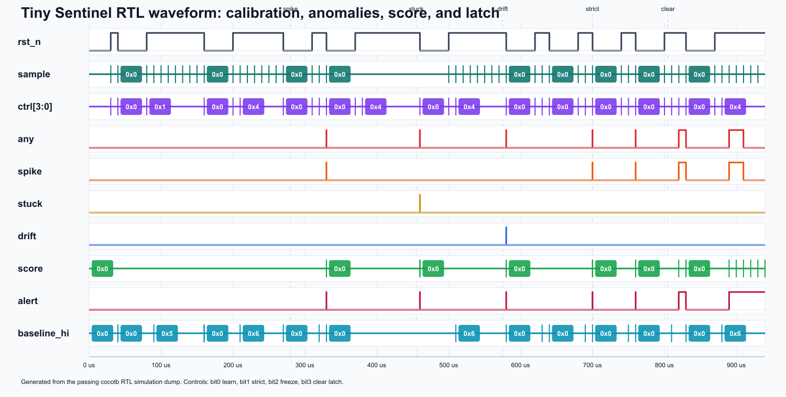
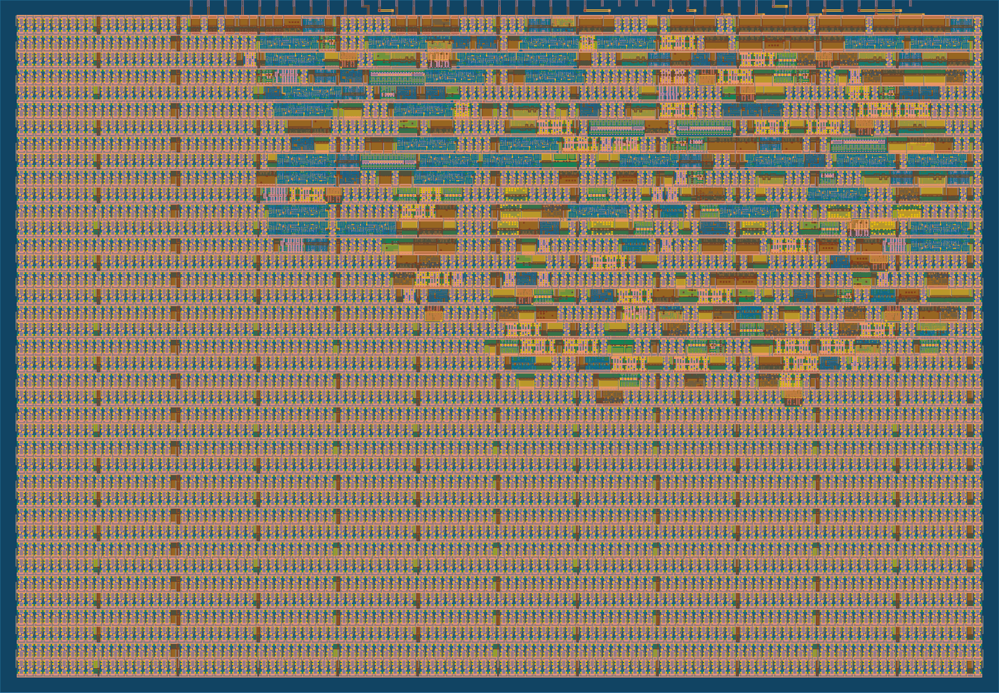

## How it works

Tiny Sentinel is a digital sensor-integrity watchdog for Tiny Tapeout. It monitors an 8-bit sensor stream, keeps an adaptive baseline, and raises deterministic flags for three common failure patterns: sudden spikes, stuck-at samples, and slow drift away from the calibrated baseline.

The design is intentionally simple and synthesizable. The baseline tracker uses shift/add arithmetic instead of multiplication or general division. During calibration, `learn_enable` captures the first sample and then nudges the baseline toward new samples. During a detection demo, keep `learn_enable` low or assert `freeze_baseline` so slow drift remains visible instead of being absorbed into the baseline.

The detector compares the current sample against both the previous sample and the baseline. A spike is a large single-cycle jump. A stuck fault is an exact repeated sample for several cycles, including repeated zero. A drift fault is a sustained deviation from the baseline without a spike. A 3-bit saturating score rises on anomaly events and decays on clean samples, while the alert latch records that an anomaly occurred until it is cleared.

## Pin map

Dedicated inputs:

- `ui_in[7:0]`: 8-bit sensor sample.

Dedicated outputs:

- `uo_out[0]`: any anomaly.
- `uo_out[1]`: spike or sudden jump detected.
- `uo_out[2]`: stuck-at sample detected.
- `uo_out[3]`: slow drift detected.
- `uo_out[6:4]`: 3-bit saturating anomaly score.
- `uo_out[7]`: latched alert.

Bidirectional pins:

- `uio_in[0]`: learn/adapt baseline enable.
- `uio_in[1]`: strict mode with lower thresholds.
- `uio_in[2]`: freeze baseline.
- `uio_in[3]`: clear latched alert.
- `uio_out[7:4]`: high nibble of the current baseline for debugging.
- `uio_out[3:0]`: tied low.
- `uio_oe`: fixed at `8'b11110000`, so the lower four `uio` pins are inputs and the upper four are outputs.

## How to test

Run the cocotb RTL testbench from the `test` directory:

```sh
make -B
```

The testbench resets the design, initializes the baseline, checks normal samples, triggers each anomaly type, verifies strict mode, verifies freeze behavior, confirms latch-clear priority, and checks score decay. The waveform dump is written to `test/tb.fst`.



For a quick hardware-style demo:

1. Hold reset low, then release it.
2. Drive `ui_in` with a normal sensor value, such as `8'd100`.
3. Pulse `uio_in[0]` high for one clock to initialize the baseline.
4. Deassert learn mode or assert freeze mode.
5. Drive normal samples near the baseline and observe no flags.
6. Drive a sudden jump, repeated sample, or slow ramp away from the baseline and observe the corresponding flag and score.
7. Pulse `uio_in[3]` high to clear `uo_out[7]`.

## External hardware

Tiny Sentinel can be driven by any external source that presents an 8-bit digital sample stream, such as a microcontroller, FPGA, sensor-interface board, switch bank, or Tiny Tapeout demoboard harness. LEDs or a logic analyzer can be attached to the outputs to visualize anomaly flags, score, latch state, and baseline debug bits.


